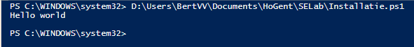
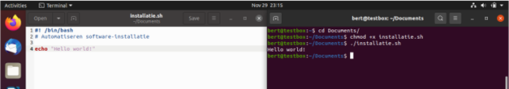
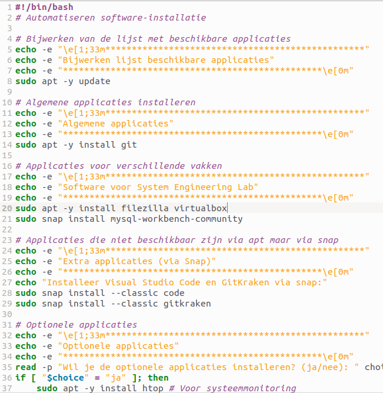
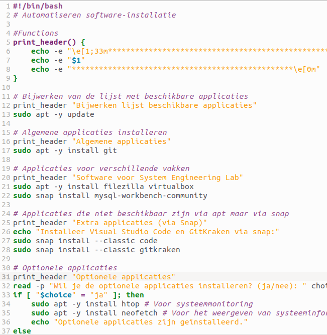

# Verslag: Package manager & Markdown

> Naam verslaggever:
>
> - Kjell Van Den Bossche,
> - Jasper Meersschaut,
> - Emiel Vandenberghe,
> - Sam Ramaswami,
> - Keanu Vervaeke

## Beschrijving

Beschrijf de opdracht in eigen woorden. Wat werd er van jullie verwacht? Wat was het doel van de opdracht?

## Antwoorden op de vragen in de opdracht

### Vraag 1 - Beantwoord onderstaande vragen.

#### Powershell

**1. De PowerShell-prompt toont de map waar we ons nu bevinden. Wat is de naam van deze directory?**<br>

We bevinden ons in de systeemmap `system32`. Dat kunnen we afleiden uit het meegegeven pad dat er als volgt uit ziet: 

```
PS C:\WINDOWS\system32>
```

**2. In welke map heb je het script bewaard?**<br>

In het mapje System Engineering Lab dat deel uitmaakt van de map HOGENT.

**3. In welke map is het script bewaard in de screenshot?**<br>

Het script is bewaard in de map SELab dat deel uitmaakt van de map HoGent. Dat halen we uit het pad meegegeven in de screenshot.

|  |
| :------------------------------------------------------------------------: |
|         Figuur 1. Resultaat van het uitgevoerde Powershell script.         |

#### Linux

**1. De Bash-prompt toont de map/directory waar we ons nu bevinden. Wat is de naam van de directory waar je in terecht komt als je een Terminal-venster opent?**

De home directory van de ingelogde gebruiker. (~$)

**2. In welke directory heb jij het script bewaard?**

In de directory /Desktop.

**3. In welke directory is het script bewaard in de screenshot?**

In de directory /Documents.

|  |
| :----------------------------------------------------------------------: |
|          Figuur 2. Resultaat van het uitgevoerde Linux script.           |

### Vraag 2 - Zoek op welke commando's je nodig hebt voor de hieronder opgesomde taken.

#### Powershell

| Taak                                                                    | Commando                         |
| ----------------------------------------------------------------------- | -------------------------------- |
| Een lijst tonen van de software die nu geïnstalleerd is via Chocolatey  | `choco list`                     |
| Alle packages die nu geïnstalleerd zijn bijwerken tot de laatste versie | `choco upgrade all`              |
| Via de console een package opzoeken                                     | `choco search <package_name>`    |
| Een geïnstalleerde applicatie verwijderen                               | `choco uninstall <package_name>` |

#### Linux

| **Taak**                                                                | **Commando**                     |
| ----------------------------------------------------------------------- | -------------------------------- |
| Een lijst tonen van de software die nu geïnstalleerd is via apt         | `apt list --installed`           |
| Alle packages die nu geïnstalleerd zijn bijwerken tot de laatste versie | `sudo apt update`                |
| Via de console een package opzoeken                                     | `apt search <package_name>`      |
| Een geïnstalleerde applicatie verwijderen                               | `sudo apt remove <package_name>` |

### Vraag 3 - Werk het installatiescript af, structureer zelf je script en zorg dat de hoofdingen meer in het oog springen.

#### Powershell

Als je onderstaand script uitvoert, krijg je de keuze of je software wilt installeren, updaten of verwijderen.

- Bij het kiezen van 'Instal' ga je de vraag krijgen of je alle software, of enkel software voor 1 vak wilt downloaden. Nadien gaat het script de software installeren afhankelijk van je keuze.
- Bij het kiezen van 'Update' gaat het script alle software updaten.

- Bij het kiezen van 'Delete' ga je moeten invullen welke software je wilt verwijderen. Nadien verwijdert het script deze software.

```PowerShell
#Automatiseren software-installatie

Function InstallAll {
    InstallAlgemeneApplicaties
    InstallSystemEngineeringLab
}
Function InstallAlgemeneApplicaties {
    Write-Host "`n`n`nInstallatie algemene applicaties"
    Write-Host "--------------------------------"
    Write-Host "`n- Git installeren"
    choco install -y git
    Write-Host "`n- Adobe Acrobat Reader installeren"
    choco install -y adobereader
    Write-Host "`n- Firefox installeren"
    choco install -y firefoxdownloadsview
    Write-Host "`n- GitHub Desktop installeren"
    choco install -y github
    Write-Host "`n- Visual Studio Code installeren"
    choco install -y vscode
    Write-Host "`n- VLC Media Player installeren"
    choco install -y vlc
}
Function InstallSystemEngineeringLab {
    Write-Host "`n`n`nInstallatie System Engineering Lab"
    Write-Host "------------------------------------"
    Write-Host "`n- FileZilla installeren"
    choco install -y filezilla
    Write-Host "`n- VirtualBox installeren"
    choco install -y virtualbox
    Write-Host "`n- MySQL Workbench installeren"
    choco install -y mysql.workbench
}

$choice = Read-Host -Prompt 'Instal [A] - Update [B] - Delete [C]'
if ('A' -eq $choice) {
    $type = Read-Host -Prompt 'Instal all [A] - Install `Algemene applicaties` [B] - Install `System Engineering Lab` [C]'
    switch ($type) {
        'A' {InstallAll}
        'B' {InstallAlgemeneApplicaties}
        'C' {InstallSystemEngineeringLab}
    }
}
if ('B' -eq $choice) {
    choco upgrade all
}
if ('C' -eq $choice) {
    $app = Read-Host -Prompt 'What package do you want to delete?'
    choco uninstall $app
}
```

#### Linux

```bash
#!/bin/bash
# Automatiseren software-installatie

# Bijwerken van de lijst met beschikbare applicaties
echo -e "\e[1;33m*************************************************"
echo -e "Bijwerken lijst beschikbare applicaties"
echo -e "*************************************************\e[0m"
sudo apt -y update

# Algemene applicaties installeren
echo -e "\e[1;33m*************************************************"
echo -e "Algemene applicaties"
echo -e "*************************************************\e[0m"
sudo apt -y install git

# Applicaties voor verschillende vakken
echo -e "\e[1;33m*************************************************"
echo -e "Software voor System Engineering Lab"
echo -e "*************************************************\e[0m"
sudo apt -y install filezilla virtualbox
sudo snap install mysql-workbench-community

# Applicaties die niet beschikbaar zijn via apt maar via snap
echo -e "\e[1;33m*************************************************"
echo -e "Extra applicaties (via Snap)"
echo -e "*************************************************\e[0m"
echo "Installeer Visual Studio Code en GitKraken via snap:"
sudo snap install --classic code
sudo snap install --classic gitkraken

# Optionele applicaties
echo -e "\e[1;33m*************************************************"
echo -e "Optionele applicaties"
echo -e "*************************************************\e[0m"
read -p "Wil je de optionele applicaties installeren? (ja/nee): " choice
if [ "$choice" = "ja" ]; then
    sudo apt -y install htop # Voor systeemmonitoring
    sudo apt -y install neofetch # Voor het weergeven van systeeminformatie
    echo "Optionele applicaties zijn geïnstalleerd."
else
    echo "Optionele applicaties worden niet geïnstalleerd."
fi

read -p "Druk op Enter om af te sluiten"

```

## Evaluatiecriteria

- [x] Je hebt een package manager voor jouw besturingssysteem geïnstalleerd.
- [x] Je hebt een script (PowerShell of Bash, afhankelijk van je besturingssysteem) geschreven en gebruikt om de opgesomde applicaties te installeren.
- [x] Je toont inzicht in de werking van een package manager en kan deze vlot kan gebruiken om basistaken uit te voeren.
- [x] Je hebt een verslag gemaakt op basis van het template.
- [x] De cheat sheet werd aangevuld met nuttige commando's die je wenst te onthouden voor later.

## Problemen en oplossingen

### Probleem 1 - Herhalende code

Voor een mooiere opmaak te hebben in het linux script, hebben we de herhalende code in functies gestoken. Dit zorgt voor een beter overzicht en een betere leesbaarheid van het script. Hoe ik dit moest doen heb ik gevonden op [Shellscript](https://www.shellscript.sh/functions.html).

|  |  |
| :-------------------------------------------------------------------------------: | :------------------------------------------------------------------------------: |
|                     Figuur 3. Voor het gebruik van functions                      |                      Figuur 4. Na het gebruik van functions                      |

## Voorbereiding demo

Beschrijf hier hoe je elk evaluatiecriterium zal demonstreren. Geef ook aan welke bestanden, commando's, enz. je zal gebruiken tijdens de demo.

### Bestanden voor de demo

- Voorbeeld van het [Installatie.ps1](./demo's/demo-1/Installatie.ps1) script.

### Commando's voor de demo

#### Powershell

| Task                                                                         | Command                          |
| :--------------------------------------------------------------------------- | :------------------------------- |
| Commentaarregel schrijven                                                    | `#`                              |
| Tekst afdrukken op de console                                                | `Write-Host`                     |
| Script runnen                                                                | `Fn + F5`                        |
| Overzicht van alle opties en parameters bruikbaar met het commando **choco** | `choco -?`                       |
| Applicatie installeren                                                       | `choco install -y <packagename>` |
| Een lijst tonen van de software die nu geïnstalleerd is via apt              | `choco list`                     |
| Alle packages die nu geïnstalleerd zijn bijwerken tot de laatste versie      | `choco upgrade all`              |
| Via de console een package opzoeken                                          | `choco search <packagename>`     |
| Een geïnstalleerde applicatie verwijderen                                    | `choco uninstall <packagename>`  |

#### Linux

| Task                                                                    | Command                          |
| :---------------------------------------------------------------------- | :------------------------------- |
| Standaard extensie voor bash scripts                                    | `.sh`                            |
| Eerste regel van script (shebang)                                       | `#!`                             |
| Commentaarregel schrijven                                               | `#`                              |
| Tekst afdrukken op de console                                           | `echo`                           |
| Commando runnen als super user                                          | `sudo`                           |
| Een lijst tonen van de software die nu geïnstalleerd is via apt         | `apt list --installed`           |
| Alle packages die nu geïnstalleerd zijn bijwerken tot de laatste versie | `sudo apt update`                |
| Via de console een package opzoeken                                     | `apt search <package_name>`      |
| Een geïnstalleerde applicatie verwijderen                               | `sudo apt remove <package_name>` |

## Reflecties

<!-- Wat was moeilijk? Wat was eenvoudig? Wat hebben jullie geleerd van de opdracht? Wat zouden jullie anders doen als jullie het opnieuw moesten doen?

Als jullie nog andere opmerkingen hebben over de opdracht hebben, voel je vrij om ze te delen. -->

Deze opdracht was tamelijk simpel, het was vooral een stappenplan volgen en zelf niet op veel code komen.

#### Wat hebben we geleerd?

We vonden het een goede oefening om te leren werken met scripting en de package manager. We hebben geleerd hoe we een script kunnen structureren en hoe we een script kunnen laten vragen naar input van de gebruiker. Git was geen deel van deze oefening, maar aangezien we dit toch voor de eerste keer in groep gebruikten, was dit ook een goede oefening.

#### Problemen?

We hebben geen problemen tegengekomen die ons veel tijd kostten.
Om zo een volledig mogelijk verslag te hebben, hebben we het script in Powershell en Linux geschreven en deze beide in het verslag gezet.

#### Wat zouden we anders doen?

We denken dat we volgende keer hetzelfde zouden doen, aangezien het soepel verliep en we geen problemen hadden.

#### Markdown

Markdown was even wennen, maar na een tijdje ging het vlot. Het is een handige manier om een verslag te maken. Het is een simpel concept dat toch veel mogelijkheden biedt.

## Bronnen

#### Powershell

- https://learn.microsoft.com/en-us/powershell/module/microsoft.powershell.utility/read-host?view=powershell-7.4
- https://learn.microsoft.com/en-us/powershell/scripting/learn/deep-dives/everything-about-if?view=powershell-7.4
- https://learn.microsoft.com/en-us/powershell/scripting/learn/ps101/09-functions?view=powershell-7.4#a-simple-function
- https://learn.microsoft.com/en-us/powershell/module/microsoft.powershell.core/about/about_switch?view=powershell-7.4

#### Linux

- https://www.shellscript.sh/functions.html
- https://unix.stackexchange.com/questions/604598/if-else-bash-statement-syntax
