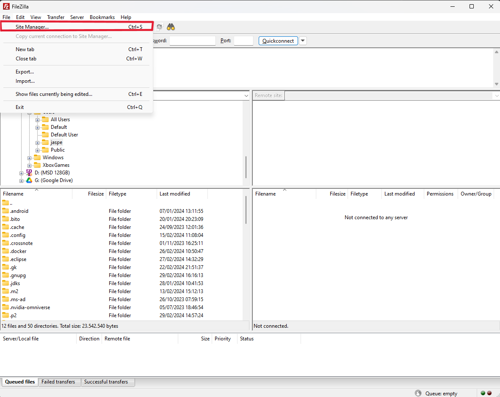

# Verslag: Een databankserver opzetten in een VM

> Naam verslaggever: Sam Ramaswami

## Beschrijving

We hebben geleerd om een databankserver op te zetten in een VM. Dit zorgt ervoor dat er geen processen op de achtergrond lopen die resources gebruiken op onze eigen laptop (ook wanneer de databank niet in gebruik is). We spraken de databank aan over een virtueel netwerk.

## Antwoorden op de vragen in de opdracht

**Controleer welke netwerkpoorten in gebruik zijn en stel vast dat MySQL enkel luistert op de "loopback interface". Waaraan zie je dit?**

Het IP-adres 127.0.0.1 is toegekend aan de loopback interface, we zien hier dat MySQL enkel hierop luistert.

 <!-- Kan iemand hier screenshot zetten van de output voor de bind-address veranderd was naar 0.0.0.0? Ik krijg da nie meer teruggezet. -->

**Zorg ervoor dat MySQL luistert naar alle netwerkinterfaces door het bestand `/etc/mysql/mysql.conf.d/mysqld.cnf` aan te passen. Zoek in dit bestand naar de regel die het **bind-address** instelt op **127.0.0.1** en verander dit naar **0.0.0.0**. Waarom `0.0.0.0` en niet het ip adres `192.168.56.20`?**	

De parameter **bind-address** bepaalt welke netwerkinterfaces MySQL gebruikt om inkomende verbindingen te accepteren. Indien dit wordt ingesteld op het loopback-adres `127.0.0.1`, zal MySQL alleen verbindingen accepteren die afkomstig zijn van de VM (dezelfde machine waarop de server draait). We stellen **bind-address** in op `0.0.0.0` omdat MySQL dan verbindingen accepteert van elk IP-adres (dus ook onze lokale machine). Het adres `192.168.56.20` is van de VM, dus dan zouden we geen connectie kunnen maken vanuit onze lokale machine.

 **Controleer met `ss -tlnp` of de wijziging effect had. Waaraan zie je dit? Wat is het verschil met de vorige uitvoer van dit commando?**

We zien dat het adres bij poort `3306` veranderd is van `127.0.0.1` naar `0.0.0.0`. MySQL luistert dus nu naar alle beschikbare netwerk interfaces.


## Uitbredingen

#### 1. Schakel de screen lock uit.

#### 2. Laat de gebruiker osboxes.org automatisch inloggen.

#### 3. Installeer handige applicaties zoals Visual Studio Code.

#### 4. Pas het wachtwoord van de gebruiker osboxes aan. Schrijf dit wachtwoord zeker op in de beschrijving van de VM via Settings > General > Description.

#### 5. Probeer of je met FileZilla/Cyberduck bestanden van/naar de VM kan kopiëren. Dit zal extra configuratie vereisen.

1. Installeer een FTP-server op de VM.

```bash
sudo apt update
sudo apt install vsftpd
```

2. Configureer de FTP-server.

```bash
sudo nano /etc/vsftpd.conf
```

- Zorg ervoor dat de volgende regels in het bestand staan:

```
anonymous_enable=NO
local_enable=YES
write_enable=YES
local_umask=022
```

3. Herstart de FTP-server.

```bash
sudo systemctl restart vsftpd
```

4. Open filezilla en maak een nieuwe verbinding aan met de VM.

- Ga naar sitebeheer (ctrl + s) > nieuwe site en vul de gegevens in.
  |  |
  | :----------------------------------------------------------------------: |
  | Figuur 1. Locatie site manager. |
- Vul het IP-adres, de grbuikersnaam en het wachtwoord in zoals in figuur 2.
  |  |
  | :----------------------------------------------------------------------: |
  | Figuur 2. Gegevens site manager. |

5. Bij een succesvolle verbinding zou je bestanden van/naar de VM moeten kunnen kopiëren. En zou je response 230 moeten krijgen zoals in figuur 3.

  |  |
  | :----------------------------------------------------------------------: |
  | Figuur 3. Succesvolle verbinding. |

> Nu kan je succesvol bestanden van/naar de VM kopiëren.
#### 6. Configureer de VM zodat je via SSH kan inloggen vanop je fysieke systeem (via een wachtwoord en/of public/private keypair).


## Evaluatiecriteria

Toon na afwerken het resultaat aan je begeleider. Elk teamlid moet in staat zijn om het resultaat te demonstreren bij de oplevering van deze opdracht! Criteria voor beoordeling:

- [x] De VM start op en je kan inloggen:
  - [x] De VM heeft een host-only adapter en een NAT adapter met de correcte instellingen.
  - [x] Je kan pingen vanop je fysieke systeem naar de host-only adapter van de VM.
  - [x] Je kan aantonen dat MySQL actief is op de VM en luistert op alle interfaces.
- [x] Je kan MySQL Workbench gebruiken om een connectie aan te maken met de databankserver:
  - [x] Je hebt een **werkende** connectie voor de admin-gebruiker
  - [ ] Je hebt een **werkende** connectie voor de applicatie-gebruiker
- [x] Je hebt een verslag gemaakt op basis van het template.
- [ ] De cheat sheet werd aangevuld met nuttige commando's die je wenst te onthouden voor later.
