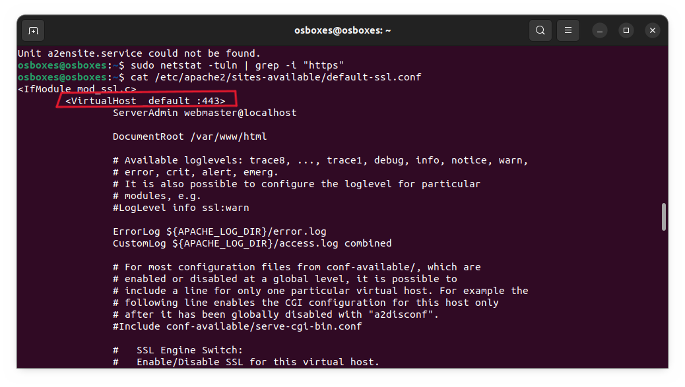

# Verslag 3: Webserver opstellen

> Naam verslaggever: Jasper Meersschaut

## :speech_balloon: Beschrijving

In deze opdracht ga je een webserver opzetten op je VM. Je zal een statische website publiceren op de webserver. Je zal ook de firewall configureren om de webserver te beveiligen. Ten slotte ga je fail2ban installeren en configureren om aanvallen op de webserver te detecteren en te blokkeren. Je zal ook een whitelist aanmaken om je eigen IP-adres toe te voegen.

## :thinking: Antwoorden op de vragen in de opdracht

**Luistert de Apache netwerkservice enkel naar de loopback-interface zoals MySQL? Of is de service meteen ook van buitenaf toegankelijk? Hoe controleer je dit?**

- Ga naar de Apache-configuratiemap. De hoofdconfiguratie zich in `/etc/apache2/ports.conf`. Open dit bestand met een teksteditor. Bijvoorbeeld met nano:
  ```bash
  sudo nano /etc/apache2/ports.conf
  ```
- In dit bestand zie je dat Apache standaard luistert op poort 80. Dit betekent dat de webserver van buitenaf toegankelijk is.
  |  |
  | :---------------------------------------------------------------------: |
  | Figuur 1. De poort waarnaar apache2 naar luistert |

**Zal de Apache service opstarten (= "enabled") bij booten van de VM? Hoe controleer je dit?**

- Om te controleren of de Apache service opstart bij het booten van de VM, kan je het volgende commando gebruiken:
  ```bash
  sudo systemctl is-enabled apache2
  ```
  Dit commando zal `enabled` teruggeven als de service opstart bij het booten van de VM.
  |  |
  | :------------------------------------------------------------: |
  | Figuur 2. De status van de Apache service bij het booten van de VM |

**Als je op de VM een website wil publiceren, dan moet je de HTML- en andere bestanden in de zogenaamde Document Root zetten. Wat is het pad naar deze map?**
`/var/www/html/`
**Met welke twee commando's kan je controleren of de SSH server draait, en op welke poort?**

- Om te controleren of de SSH server draait, kan je het volgende commando gebruiken:
  ```bash
  sudo systemctl status ssh
  ```
  |  |
  | :-----------------------------------------------------: |
  |         Figuur 3. De status van de SSH service          |
  > Op dit scherm kan je zien dat de service draait en welke poort deze naar luister.

**Welke netwerkpoort wordt gebruikt voor HTTPS? Met welk commando kan je dit opzoeken?**

- Je kan dit vinden in `/etc/apache2/sites-available/default-ssl.conf`
  Dus met het commando:
  ```bash
  cat /etc/apache2/sites-available/default-ssl.conf
  ```
  |  |
  | :------------------------------------------------------: |
  |   Figuur 4. De poort waarop de HTTPS service luistert    |

**Gebruik systemctl om fail2ban op te starten bij het starten van de VM. Hoe kan je opzoeken of dit correct gebeurd is?**
Je kan zorgen dat fail2ban opstart bij het starten van de VM met het commando:

```bash
sudo systemctl enable fail2ban
```

Je kan controleren of dit correct gebeurd is met het commando:

```bash
sudo systemctl is-enabled fail2ban
```

## :memo: Evaluatiecriteria

Toon na afwerken het resultaat aan je begeleider. Elk teamlid moet in staat zijn om het resultaat te demonstreren bij de oplevering van deze opdracht! Criteria voor beoordeling:

- [x] Je kan de VM opstarten.
- [x] Je kan met FileZilla (of een gelijkaardige applicatie) bestanden naar de Document Root van de webserver kopiëren.
- [x] De website is te zien in een webbrowser op het fysieke systeem via URL <https://192.168.56.20>.
- [x] Je kan aantonen dat de firewall actief is en dat de juiste poorten toegelaten zijn in de firewall:
  - [x] Je kan aantonen dat je nog steeds kan verbinden via SSH of SFTP.
  - [x] Je kan aantonen dat de MySQL Workbench nog steeds kan verbinden met de VM.
  - [x] Je kan aantonen dat je website nog steeds bereikbaar is.
- [x] Je kan aantonen dat fail2ban actief is.
- [x] Je kan de inhoud van het **jail.local** bestand tonen en toelichten.
- [x] Je kan met de **fail2ban** command line client aantonen dat de **findtime**, **maxretry** en **bantime** juist zijn ingesteld. Je kan deze begrippen toelichten.
- [x] Je kan aantonen dat je via SSH kan inloggen op de VM vanop jouw fysiek toestel en dat fail2ban jouw IP-adres blokkeert als je te veel foutieve inlogpogingen doet.
- [x] Je kan aantonen dat een IP-adres op de whitelist niet wordt geblokkeerd.
- [x] Je hebt een verslag gemaakt op basis van het template.
- [x] De cheat sheet werd aangevuld met nuttige commando's die je wenst te onthouden voor later.

## :question: Problemen en oplossingen

<!-- Beschrijf hieronder eventuele problemen die jullie zijn tegengekomen tijdens het uitvoeren van de opdracht, met een korte beschrijving van wat er mis ging en hoe jullie het hebben opgelost (als het jullie gelukt is om het op te lossen). Als het niet gelukt is om het op te lossen, beschrijf dan hoe ver jullie zijn gekomen en wat jullie tegenhield om verder te gaan. Voeg eventuele foutmeldingen, screenshots, enz. toe.

Als jullie geen problemen zijn tegengekomen, schrijf dan "geen problemen ondervonden". -->

<!-- ### Probleem 1 - Korte beschrijving van het probleem

Beschrijf hier het probleem uitgebreid met screenshots, code snippets, enz. en de oplossing die jullie al dan niet hebben gevonden. -->

### Probleem 1: Fail2ban active: failed

> [818]: ERROR Failed during configuration: While reading from 'etc/fail2ban/jail.local' [line 6]: option 'logpath' in section 'sshd' already exists

- **Oorzaak**: De logpath voor de sshd service stond dubbel in het bestand **jail.local** (figuur 6).
- **Oplossing**: De dubbele regel verwijderen uit het bestand **jail.local** (figuur 7).
  |  |
  | :---------------------------------------------------------------: |
  | Figuur 5. fail2ban error |

  |  |
  | :------------------------------------------------------------: |
  |           Figuur 6. De foutieve **jail.local** file            |

  |  |
  | :-----------------------------------------------------------: |
  |          Figuur 7. De aangepaste **jail.local** file          |

## :information_desk_person: Voorbereiding demo

Beschrijf hier hoe je elk evaluatiecriterium zal demonstreren. Geef ook aan welke bestanden, commando's, enz. je zal gebruiken tijdens de demo.

### Je kan met FileZilla (of een gelijkaardige applicatie) bestanden naar de Document Root van de webserver kopiëren.

- Start FileZilla op.
- Maak een nieuwe verbinding aan met de volgende gegevens:
  - Host: 192.168.56.20
  - Gebruikersnaam: osboxes
  - Wachtwoord: osboxes.org
  - Poort: 22
- Verbind met de VM.
- Kopieer de websitebestanden naar de document root.
  |  |
  | :-----------------------------------------------------: |
  | Figuur 8. Connectie via FileZilla |

### De website is te zien in een webbrowser op het fysieke systeem via URL <https://192.168.56.20>.

- Open een webbrowser en ga naar <https://192.168.56.20>.

|  |
| :------------------------------------------------------------------------------: |
|                Figuur 9. Website bereikbaar via fysieke computer                 |

### Je kan aantonen dat de firewall actief is en dat de juiste poorten toegelaten zijn in de firewall:

- Gebruik dit commando om te controleren de firewall actief is en dat de juiste poorten toegelaten zijn in de firewall:
  ```bash
  sudo ufw status
  ```
  |  |
  | :-----------------------------------------------------------------------------: |
  |                      Figuur 10. De status van de firewall                       |

#### Je kan aantonen dat je nog steeds kan verbinden via SSH of SFTP.

- Open een terminal en verbind met de VM via SSH met het volgende commando:
  ```bash
  ssh osboxes@192.168.56.20
  ```

#### Je kan aantonen dat de MySQL Workbench nog steeds kan verbinden met de VM.

- Open MySQL Workbench en verbind met de VM.

#### Je kan aantonen dat je website nog steeds bereikbaar is.

- Open een webbrowser en ga naar <https://192.168.56.20>.

### Je kan aantonen dat fail2ban actief is.

- Gebruik dit commando om te controleren of fail2ban actief is:
  ```bash
  sudo systemctl status fail2ban
  ```

### Je kan de inhoud van het **jail.local** bestand tonen en toelichten.

- Gebruik dit commando om de inhoud van het **jail.local** bestand te tonen:
  ```bash
  cat /etc/fail2ban/jail.local
  ```

### Je kan met de **fail2ban** command line client aantonen dat de **findtime**, **maxretry** en **bantime** juist zijn ingesteld. Je kan deze begrippen toelichten.

- Gebruik dit commando om de **findtime**, **maxretry** en **bantime** te tonen:
  ```bash
  sudo fail2ban-client get sshd
  ```

### Je kan aantonen dat je via SSH kan inloggen op de VM vanop jouw fysiek toestel en dat fail2ban jouw IP-adres blokkeert als je te veel foutieve inlogpogingen doet.

- Open een terminal en verbind met de VM via SSH met het volgende commando:
  ```bash
  ssh osboxes@192.168.56.20
  ```
- Voer een aantal keer een foutief wachtwoord in.
- Je zal zien dat je geblokkeerd wordt.

### Je kan aantonen dat een IP-adres op de whitelist niet wordt geblokkeerd.

- Open de 2de vm en probeer in te loggen op de eerste vm met een foutief wachtwoord. Je zal zien dat je niet geblokkeerd wordt omdat je op de whitelist staat.

## Mogelijke uitbreidingen

### Hydra

Wil je eens kijken hoe fail2ban zich gedraagt met een aanvalstool? Zorgt fail2ban voor voldoende beveiliging? Je kan de tool Hydra loslaten op jouw VM om dit te valideren.

- Met het commando `sudo apt install hydra` kan je Hydra installeren.
- Je kan dan een wachtwoordenlijst downloaden op het internet.
- Met het commando `hydra -l osboxes -P /usr/share/wordlists/rockyou.txt 192.168.56.20 -t 4 ssh -V -e nsr` kan je de bruteforce-aanval starten.
- We zien in onze webserver dat de aanval is geblokeerd.

Er is zelfs nog een betere manier om brute force tools en bots totaal geen kans te geven. Weet je welke manier? Hoe kan je dit instellen?

- Je kan de bantime voor een aanvaller steeds verhogen naar mate van het aantal keer de aanvaller al gebanned is.
- Dat doe je door volgende lijnen in het bestand jail.local toe te voegen:

  `bantime.increment = true`

  `bantime.factor = 2`

  `bantime.formula = ban.Time * (1<<(ban.Count if ban.Count<20 else 20)) * banFactor`

### Awesome selfhosted

Download een awesome selfhosted programma van github en installeer het op je webserver.
|  |
| :--------------------------------------------------------------: |
| Figuur 11. De website van awesome selfhosted via FileZilla overzetten|

## Reflecties

<!-- Wat was moeilijk? Wat was eenvoudig? Wat hebben jullie geleerd van de opdracht? Wat zouden jullie anders doen als jullie het opnieuw moesten doen?

Als jullie nog andere opmerkingen hebben over de opdracht hebben, voel je vrij om ze te delen. -->

Deze opdracht was opnieuw een leuke uitdaging. Het was interessant om te zien hoe we een webserver konden opzetten en beveiligen.
Zelf eens een brute force aanval uitvoeren op onze eigen server was ook een leuke ervaring. Het was interessant om te zien hoe fail2ban hiermee omging.
We waren tegen 1 probleem aangelopen, maar dit was snel opgelost.

## Bronnen

<!-- Maak een lijst van alle bronnen die jullie hebben gebruikt tijdens het uitvoeren van de opdracht: boeken, handleidingen, HOWTO's, blog posts, enz. -->

- [How to install and configure hydra brute force tool](https://www.linuxfordevices.com/tutorials/linux/hydra-brute-force-ssh)
- [Awesome selfhosted](https://github.com/awesome-selfhosted/awesome-selfhosted)
