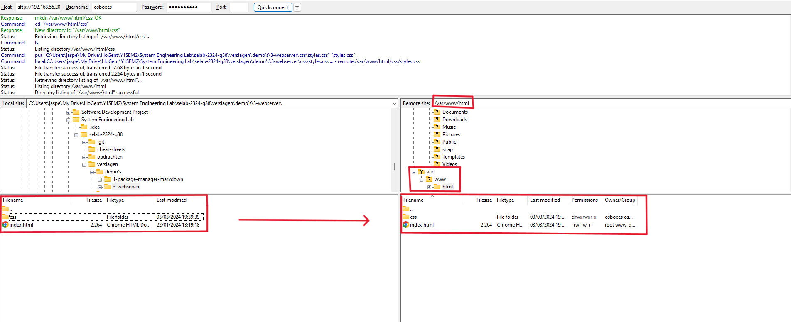

# Verslag 3: Webserver opstellen

> Naam verslaggever: Jasper Meersschaut

## :speech_balloon: Beschrijving

In deze opdracht ga je een webserver opzetten op je VM. Je zal een statische website publiceren op de webserver. Je zal ook de firewall configureren om de webserver te beveiligen. Ten slotte ga je fail2ban installeren en configureren om aanvallen op de webserver te detecteren en te blokkeren. Je zal ook een whitelist aanmaken om je eigen IP-adres toe te voegen.

## :thinking: Antwoorden op de vragen in de opdracht

<!-- Voeg hieronder de antwoorden op de vragen in de opdracht toe. Gebruik voor elke vraag een aparte sectie. -->

### Vraag 1 -

**Luistert de Apache netwerkservice enkel naar de loopback-interface zoals MySQL? Of is de service meteen ook van buitenaf toegankelijk? Hoe controleer je dit?**

- Ga naar de Apache-configuratiemap. De hoofdconfiguratie zich in `/etc/apache2/ports.conf`. Open dit bestand met een teksteditor. Bijvoorbeeld met nano:
  ```bash
  sudo nano /etc/apache2/ports.conf
  ```
- In dit bestand zie je dat Apache standaard luistert op poort 80. Dit betekent dat de webserver van buitenaf toegankelijk is.
  |  |
  | :---------------------------------------------------------------------: |
  | Figuur 1. De poort waarnaar apache2 naar luistert |

**Zal de Apache service opstarten (= "enabled") bij booten van de VM? Hoe controleer je dit?**

- Om te controleren of de Apache service opstart bij het booten van de VM, kan je het volgende commando gebruiken:
  ```bash
  sudo systemctl is-enabled apache2
  ```
  Dit commando zal `enabled` teruggeven als de service opstart bij het booten van de VM.
  |  |
  | :------------------------------------------------------------: |
  | Figuur 2. De status van de Apache service bij het booten van de VM |

**Als je op de VM een website wil publiceren, dan moet je de HTML- en andere bestanden in de zogenaamde Document Root zetten. Wat is het pad naar deze map?**
`/var/www/html/`
**Met welke twee commando's kan je controleren of de SSH server draait, en op welke poort?**

- Om te controleren of de SSH server draait, kan je het volgende commando gebruiken:
  ```bash
  sudo systemctl status ssh
  ```
  Dit commando zal de status van de SSH service tonen.
  |  |
  | :-----------------------------------------------------: |
  | Figuur 3. De status van de SSH service |
- Om te controleren op welke poort de SSH server draait, kan je het volgende commando gebruiken:
  ```bash
  cat /etc/ssh/sshd_config
  ```
  Hierin kan je de configuratie van de SSH server zien. De standaardpoort is 22.

## :memo: Evaluatiecriteria

Toon na afwerken het resultaat aan je begeleider. Elk teamlid moet in staat zijn om het resultaat te demonstreren bij de oplevering van deze opdracht! Criteria voor beoordeling:

- [ ] Je kan de VM opstarten.
- [ ] Je kan met FileZilla (of een gelijkaardige applicatie) bestanden naar de Document Root van de webserver kopiëren.
- [ ] De website is te zien in een webbrowser op het fysieke systeem via URL <https://192.168.56.20>.
- [ ] Je kan aantonen dat de firewall actief is en dat de juiste poorten toegelaten zijn in de firewall:
  - [ ] Je kan aantonen dat je nog steeds kan verbinden via SSH of SFTP.
  - [ ] Je kan aantonen dat de MySQL Workbench nog steeds kan verbinden met de VM.
  - [ ] Je kan aantonen dat je website nog steeds bereikbaar is.
- [ ] Je kan aantonen dat fail2ban actief is.
- [ ] Je kan de inhoud van het **jail.local** bestand tonen en toelichten.
- [ ] Je kan met de **fail2ban** command line client aantonen dat de **findtime**, **maxretry** en **bantime** juist zijn ingesteld. Je kan deze begrippen toelichten.
- [ ] Je kan aantonen dat je via SSH kan inloggen op de VM vanop jouw fysiek toestel en dat fail2ban jouw IP-adres blokkeert als je te veel foutieve inlogpogingen doet.
- [ ] Je kan aantonen dat een IP-adres op de whitelist niet wordt geblokkeerd.
- [ ] Je hebt een verslag gemaakt op basis van het template.
- [ ] De cheat sheet werd aangevuld met nuttige commando's die je wenst te onthouden voor later.

## :question: Problemen en oplossingen

<!-- Beschrijf hieronder eventuele problemen die jullie zijn tegengekomen tijdens het uitvoeren van de opdracht, met een korte beschrijving van wat er mis ging en hoe jullie het hebben opgelost (als het jullie gelukt is om het op te lossen). Als het niet gelukt is om het op te lossen, beschrijf dan hoe ver jullie zijn gekomen en wat jullie tegenhield om verder te gaan. Voeg eventuele foutmeldingen, screenshots, enz. toe.

Als jullie geen problemen zijn tegengekomen, schrijf dan "geen problemen ondervonden". -->

<!-- ### Probleem 1 - Korte beschrijving van het probleem

Beschrijf hier het probleem uitgebreid met screenshots, code snippets, enz. en de oplossing die jullie al dan niet hebben gevonden. -->

## :information_desk_person: Voorbereiding demo

Beschrijf hier hoe je elk evaluatiecriterium zal demonstreren. Geef ook aan welke bestanden, commando's, enz. je zal gebruiken tijdens de demo.

### Stap 1 - installatie

- `sudo apt install apache2` installeert de apache webserver
- `sudo systemctl status apache2` toont de status van de apache webserver
- `sudo systemctl is-enabled apache2` toont of de apache webserver opstart bij het booten van de VM
- `sudo nano /etc/apache2/ports.conf` toont de configuratie van de apache webserver
- `/var/www/html/` is de map waarin de websitebestanden moeten geplaatst worden

### Stap 2 - Een statische website publiceren

> Filezilla zou al geïnstalleerd en geconfigureerd moeten zijn.

- `sudo usermod -aG www-data osboxes` voegt de gebruiker osboxes toe aan de groep www-data
- `sudo chgrp -R www-data /pad/naar/document/root` verandert de groep van de document root naar www-data
- sudo chmod -R g+w /pad/naar/document/root` geeft de groep www-data schrijfrechten op de document root
- Verbind via filezilla met de VM en kopieer de websitebestanden naar de document root
  |  |
  | :-----------------------------------------------------: |
  | Figuur 4. Connectie via FileZilla |
  |  |
  | :-----------------------------------------------------: |
  | Figuur 5. Website bereikbaar via fysieke computer |

## Reflecties

<!-- Wat was moeilijk? Wat was eenvoudig? Wat hebben jullie geleerd van de opdracht? Wat zouden jullie anders doen als jullie het opnieuw moesten doen?

Als jullie nog andere opmerkingen hebben over de opdracht hebben, voel je vrij om ze te delen. -->

## Bronnen

<!-- Maak een lijst van alle bronnen die jullie hebben gebruikt tijdens het uitvoeren van de opdracht: boeken, handleidingen, HOWTO's, blog posts, enz. -->
