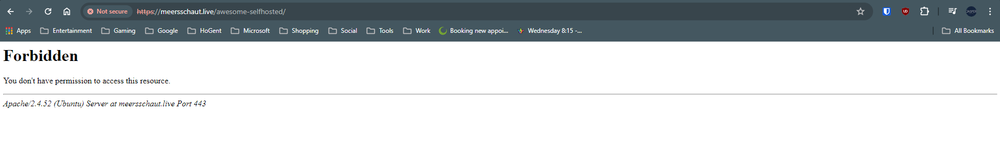
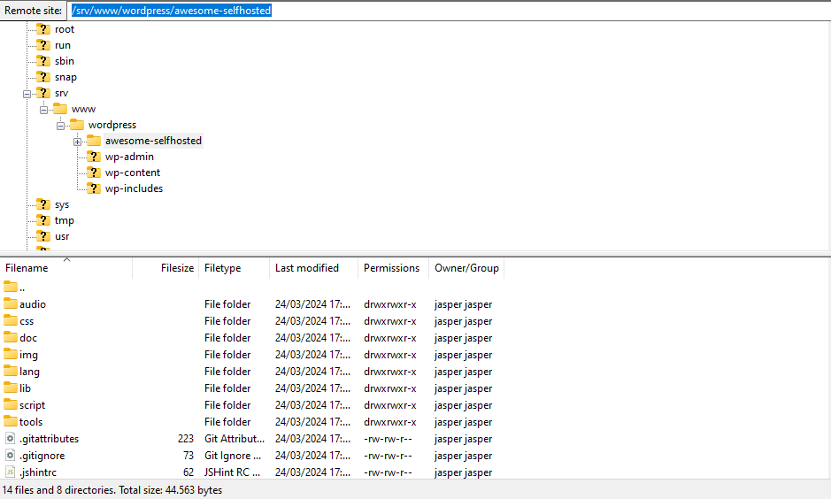
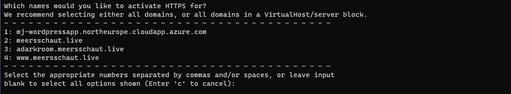
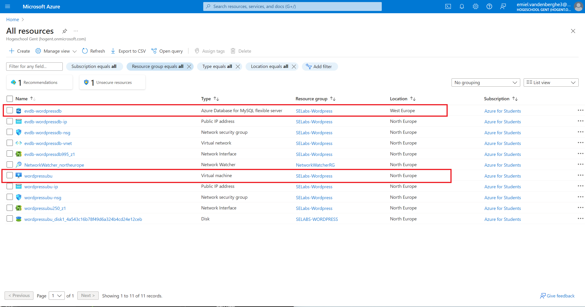
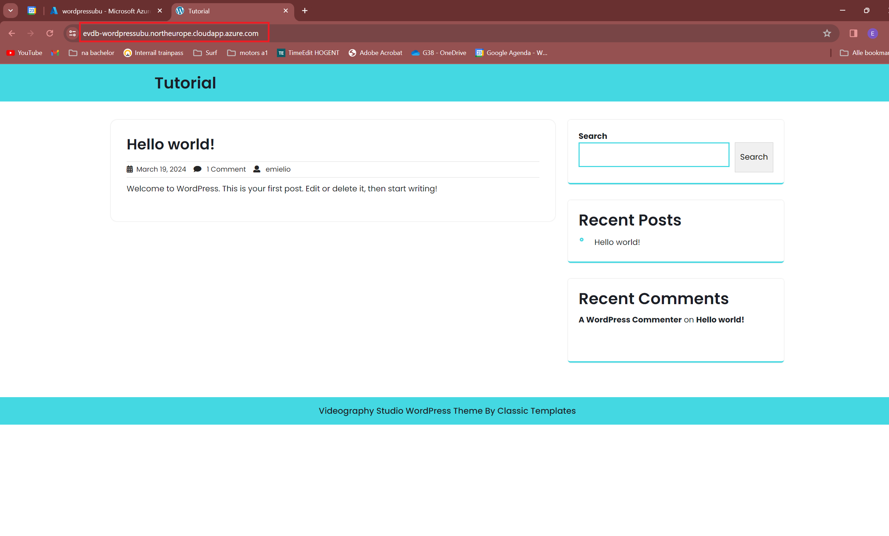
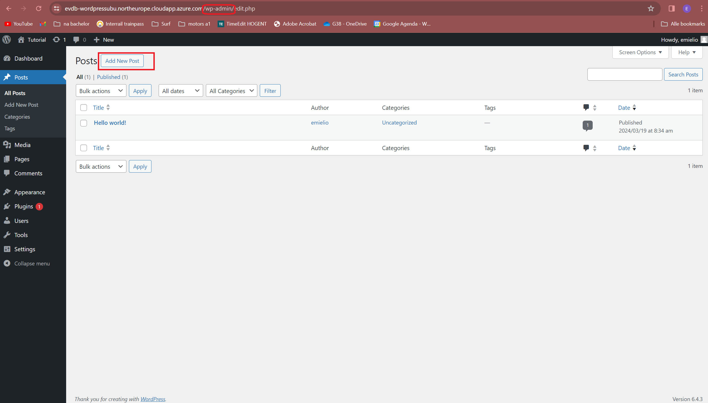
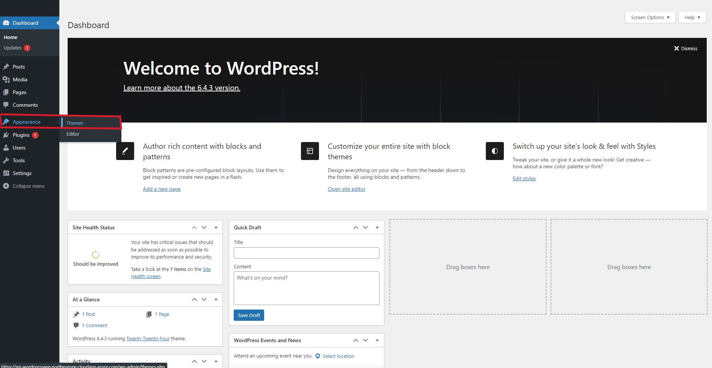
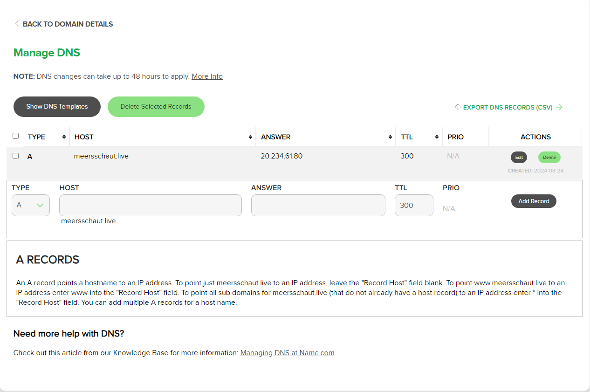
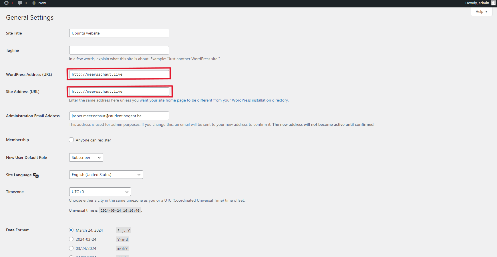

# Verslag 4: WordPress opzetten in de Microsoft Azure cloudomgeving

> Naam verslaggever: Emiel Vandenberghe

## :speech_balloon: Beschrijving

In deze opdracht hebben we een virtuele machine opgezet in Azure en hierop een WordPress blog geïnstalleerd. We hebben ook een MySQL database opgezet en deze gekoppeld aan de WordPress blog. We hebben ook een SSL certificaat aangevraagd en geïnstalleerd op de virtuele machine. Als uitbreidingen hebben we een domeinnaam aangevraagd en de WordPress blog hieraan gekoppeld. We hebben ook een nieuw thema geïnstalleerd op de WordPress blog.

## :thinking: Antwoorden op de vragen in de opdracht

**In de configuratiemap van Apache is er nog een map /etc/apache2/sites-enabled Wat is verschil tussen beide?**

- Het verschil tussen de twee mappen is dat `sites-available` alle mogelijke opties bevat, terwijl `sites-enabled `alleen de actieve configuraties bevat die Apache daadwerkelijk gebruikt. Dit maakt het gemakkelijk om verschillende websites in- en uit te schakelen zonder de configuratiebestanden te hoeven verwijderen of hernoemen.

## :memo: Evaluatiecriteria

- [x] Je kan de aangemaakte machines tonen in de Azure omgeving.
- [x] Het lukt om een SSH-verbinding op te zetten met de applicatieserver.
- [x] Het lukt om aan te melden op MySQL op de databankserver vanaf de applicatieserver.
- [x] Je kan met HTTPS surfen naar jouw WordPress blog.
- [x] Je kan kan aanmelden en het WordPress dashboard tonen.
- [x] Je kan een nieuw bericht posten op jouw WordPress blog.
- [x] Je hebt een verslag gemaakt op basis van het template.
- [x] De cheat sheet werd aangevuld met nuttige commando's die je wenst te onthouden voor later.

## :question: Problemen en oplossingen

### Probleem 1: Kan awesome-selfhosted niet bereiken (Jasper)

Ik heb de website in de wordpress folder gestoken maar ik kan de website niet bereiken.

#### Wat heb ik geprobeerd?

- Ik heb de website in de wordpress folder gestoken
- Ik heb de permisies van de folder aangepast
- Ik heb de apache server herstart
- Ik heb in wordpress.conf dit toegevoegd:

```apache
    <Directory /srv/www/wordpress/folderwithhtmlfiles>
        Options Indexes FollowSymLinks
        AllowOverride None
        Require all granted
    </Directory>
```

Maar dit werkte niet.

- Ik heb de permisies van de folder aangepast zodat apache de folder kan lezen

```bash
sudo chown -R www-data:www-data /srv/www/wordpress/folderwithhtmlfiles
```

|                           |
| :----------------------------------------------------------------------------------------------: |
| Figuur 12. Error 403 Forbidden bij het openen van de website meersschaut.live/awesome-selfhosted |

|  |
| :----------------------------------------------------------------------: |
|                          Figuur 13. Folder tree                          |

#### Wat was de oplossing?

> Na lang zoeken heb ik een oplossing gevonden. Ik weet niet of dit de bedoeling was op deze manier maar het werkt wel. En de andere manier werkte niet.

- Ik heb de files in apache gestoken in de folder `/var/www/html` en nu werkt het wel.
- Ik heb een nieuw conf bestand aangemaakt `/etc/apache2/sites-available/adarkroom-main.conf` met de volgende inhoud:

```apache
<VirtualHost *:80>
    ServerName adarkroom.meersschaut.live
    DocumentRoot /var/www/html/adarkroom-main

    <Directory /var/www/html/adarkroom-main>
        Options Indexes FollowSymLinks
        AllowOverride All
        Require all granted
    </Directory>
</VirtualHost>
```

- Ik heb de site enabled met `sudo a2ensite adarkroom-main`
- Ik heb apache herstart met `sudo systemctl restart apache2`
- Nu is de site bereikbaar op [adarkroom.meersschaut.live](http://adarkroom.meersschaut.live)

### Probleem 2: Custom dns naam verwijst opeens naar awesome selfhosted website en niet meer naar de wordpress website (Jasper)

> Ik was bezig met de laatste uitbreiding en omdat www.meersschaut.live en meersschaut.live er niet opkwamen bij certbot maar adarkroom.meersschaut.live wel, dacht ik dat ik ook een virtual host moest maken voor meersschaut.live en www.meersschaut.live. Maar nu verwijst meersschaut.live naar de awesome selfhosted website en niet meer naar de wordpress website.

- Ik heb de stappen die ik had uitgevoerd ongedaan gemaakt maar dit werkte niet.
- Ik heb de stappen nog eens opnieuw uitgevoerd van de setup maar dit werkte ook niet.
- Ik ga het hierbij laten aangezien ik het niet nog meer wil verpesten.

#### Wat was de oplossing?

> Ik heb het probleem opgelost. Ik heb in de configuratie van de wordpress website de `ServerName` aangepast naar `meersschaut.live` en `www.meersschaut.live` en nu werkt het weer. Maar ik weet niet of dit de bedoeling was.

```apache
<VirtualHost *:80>
    ServerName meersschaut.live
    ServerAlias www.meersschaut.live
    DocumentRoot /var/www/html/wordpress
    <Directory /var/www/html/wordpress>
        Options Indexes FollowSymLinks
        AllowOverride All
        Require all granted
    </Directory>
</VirtualHost>
```

#### Wat heeft dit nog opgelost?

> Door hierop te troubleshooten heb ik ook het probleem van certbot opgelost. De dns staat nu ook in de lijst van certbot en ik heb een certificaat aangemaakt voor meersschaut.live en www.meersschaut.live.

|  |
| :-----------------------------------------------------------------------: |
|                 Figuur 14. De volledige lijst van certbot                 |

### Probleem 3: De website is nog bereikbaar via het ip adres maar de css is weg (Jasper)

> Na het probleem van de custom dns naam die niet meer werkte, werkte de website nog wel via het originele ip adres maar op deze website is alle css weg.

- Is geen groot probleem in deze situatie dus heb ik niet verder onderzocht.

## :information_desk_person: Voorbereiding demo

### Je kan de aangemaakte machines tonen in de Azure omgeving.

- Surf naar https://portal.azure.com/#home
  - Navigaar naar all resources
  - Toon de VM en de Azure database

|  |
| :---------------------------------------------------------: |
|      Figuur 1. Aantonen aangemaakte machines in Azure       |

### Het lukt om een SSH-verbinding op te zetten met de applicatieserver.

- Navigeer naar de virtuele machine op azure
  - Kopieer de DNS name
  - Open je command prompt op windows en voer `ssh <gebruikersnaam>@<dns naam> ` in
  - Geef vervolgens dan het wachtwoord in dat je bijhield op je cheatcheet

|  |
| :------------------------------------------------------------------------------------: |
|                         Figuur 2. DNS naam zoeken en kopieren                          |

|  |
| :----------------------------------------------------------------------------------------: |
|                       Figuur 3. Aantonen succesvolle SSH verbinding                        |

### Het lukt om aan te melden op MySQL op de databankserver vanaf de applicatieserver.

- Open de reeds gemaakt SSH verbinding met de applicatieserver
- Haal eerst de laatste informatie van de package repositories op met `sudo apt update `
- Voer de updates uit `sudo apt upgrade`
- Installeer MySQL client met ` sudo apt install mysq-client`

|  |
| :------------------------------------------------------------------------------------: |
|                     Figuur 4. command prompt voorbereiden op mysql                     |

- Verbind met Mysql databankserver met `mysql -h \<host> -u \<user> -p`
  - Navigeer voor de gegevens naar de databankserver op Azure
  - Als je hier een error krijgt zal je eerst de instellingen van de firewall moeten aanpassen op Azure. Je moet hier je IP adres goed zetten.

|  |
| :------------------------------------------------------------------------------------: |
|                       Figuur 5. Met de databankserver verbinden                        |

### Je kan met HTTPS surfen naar jouw WordPress blog.

- Je configureerd word press volgens de stappen.
- Surf naar je DNS naam op een browser

|  |
| :-------------------------------------------------------------: |
|          Figuur 6. Succesvolle connectie met Wordpress          |

- Als je je certificaat correct hebt aangevraagd zou je ook dit moeten krijgen

|  |
| :------------------------------------------------------------------------------------: |
|                      Figuur 7. Succesvol aangemaakte certificaat                       |

### Je kan een nieuw bericht posten op jouw WordPress blog.

- Surf naar je DNS naam en typ hieracher `/wp-admin`
  - Log in
- Navigeer naar posts en laat je creativiteit maar gaan!

|  |
| :-----------------------------------------------------------: |
|                Figuur 8. Een niewe post maken                 |

## Mogelijke uitbreidingen

### Configuur de virtuele machine zodat je kan aanmelden met een SSH key.

- Genereer een SSH key met `ssh-keygen -t rsa -b 4096 -C ` als je dit nog niet had.
- Ga in je vm naar de map `~/.ssh` en maak een bestand `authorized_keys` aan. Kopieer hier de inhoud van je public key `C:\Users\jaspe\.ssh\id_rsa.pub` in.
- Nu kan je inloggen met `ssh <gebruikersnaam>@<dns naam>` zonder wachtwoord.

### Installeer een ander thema voor je WordPress blog.

- Ga naar je WordPress dashboard en navigeer naar `Appearance` en `Themes`
- Kies een thema en installeer deze
  |  |
  | :------------------------------------------------------------------------------------: |
  | Figuur 9. Een nieuw thema installeren |

### Maak een script voor de installatie van de WordPress blog.

```bash
#!/bin/bash
sudo apt update
sudo apt install apache2 \
                 ghostscript \
                 libapache2-mod-php \
                 php \
                 php-bcmath \
                 php-curl \
                 php-imagick \
                 php-intl \
                 php-json \
                 php-mbstring \
                 php-mysql \
                 php-xml \
                 php-zip
sudo mkdir -p /srv/www
sudo chown www-data: /srv/www
curl https://wordpress.org/latest.tar.gz | sudo -u www-data tar zx -C /srv/www
touch /etc/apache2/sites-available/wordpress.conf
echo '<VirtualHost *:80>
    DocumentRoot /srv/www/wordpress
    <Directory /srv/www/wordpress>
        Options FollowSymLinks
        AllowOverride Limit Options FileInfo
        DirectoryIndex index.php
        Require all granted
    </Directory>
    <Directory /srv/www/wordpress/wp-content>
        Options FollowSymLinks
        Require all granted
    </Directory>
</VirtualHost>' > /etc/apache2/sites-available/wordpress.conf
sudo a2ensite wordpress
sudo a2enmod rewrite
sudo a2dissite 000-default
sudo service apache2 reload
mysql -h kvdb-wordpressdb.mysql.database.azure.com -u wordpressdb -p
sudo -u www-data cp /srv/www/wordpress/wp-config-sample.php /srv/www/wordpress/wp-config.php
echo '<?php
define( 'DB_NAME', 'wordpress' );
define( 'DB_USER', 'wordpress' );
define( 'DB_PASSWORD', 'wordpresspwd' );
define( 'DB_HOST', 'kvdb-wordpressdb.mysql.database.azure.com' );
define( 'DB_CHARSET', 'utf8' );
define( 'DB_COLLATE', '' );
define('AUTH_KEY',         '6E=a`6+v<EuNIa }%M0YVQo=:}/mZvdojU@et-g?mSIU-7s*|&PM(^|ez&T@+57(');
define('SECURE_AUTH_KEY',  's(&+*m_-0Wq>*<f9+bk!Yr4}yY`u%Z@b|38^I7@Fv1@Y>fSS?[t-+U`y3Gm#d5LH');
define('LOGGED_IN_KEY',    '?Z;#wXUjB$NQ<<gk9cgi36FX|y5YQBvgRa@Q6c*17H.3GXuf4*Xq5lYgrL5Q7-iM');
define('NONCE_KEY',        '/+z-Q3xCz1Uc`j|Rx_JsDQ-]JAzLHH-o/_h-q7GA/i-m`V>=+1Ph(Vh2r.I|ce,?');
define('AUTH_SALT',        '0b!,5*i0F`RoV/.jJonCfCnmQyNBSw:PeN+=5Cqz5DAhYBNklC`s-TK2>f~FQ&5S');
define('SECURE_AUTH_SALT', 'q&|dJ_7r-ghK[Y8`xeV5J0jV@-?WqW?pO:4I4!07,J$XWYYnCg4m~u,:T<c3?Ce-');
define('LOGGED_IN_SALT',   'v$tF-EJ6b[J5+l-V@}8$MUNfA%&-X?|_}rw/tu_]5s<k)n*J/f~VzaSg69RwY|_C');
define('NONCE_SALT',       'xRv0J@j4r{e/|9ou9vGW-?rJ7!MT*S~G<.,s~+YX7H8PM1_N<ngV)?nU `J%Ydk ');
$table_prefix = 'wp_';
define( 'WP_DEBUG', false );
define('MYSQL_CLIENT_FLAGS', MYSQLI_CLIENT_SSL);
if ( ! defined( 'ABSPATH' ) ) {
        define( 'ABSPATH', __DIR__ . '/' );
}
require_once ABSPATH . 'wp-settings.php';' > /srv/www/wordpress/wp-config.php
```

### Voer andere veiligheidsmaatregelen door op de virtuele machine (bv. fail2ban).

- Update de package repositories met `sudo apt update`
- Upgrade de geïnstalleerde pakketten met `sudo apt upgrade`
- Installeer fail2ban met `sudo apt install fail2ban`
- Start fail2ban met `sudo systemctl start fail2ban`
- Zorg ervoor dat fail2ban automatisch start bij het opstarten met `sudo systemctl enable fail2ban`
- Controleer of fail2ban actief is met `sudo systemctl status fail2ban`
- Configureer fail2ban naar wens met `sudo nano /etc/fail2ban/jail.local`
  - bv. `bantime = 600` om de ban tijd te verlengen naar 10 minuten
  - bv. `maxretry = 3` om het aantal pogingen te verlagen naar 3
  - bv. `findtime = 600` om de tijd te verlengen naar 10 minuten

### De WordPress blog is bereikbaar via een eigen domeinnaam.

- Claim een domeinnaam bij een provider naar keuze (name.com, namecheap.com, ...)
- Ga naar de DNS instellingen van je domeinnaam en voeg een A-record toe dat verwijst naar het IP-adres van je Azure VM, geef als hostnaam `@` op. (Zie figuur 10)
- Wacht enkele uren tot de DNS instellingen zijn doorgevoerd.
- Ga naar je WordPress dashboard en navigeer naar `Settings` en `General`
- Vul bij `WordPress Address (URL)` en `Site Address (URL)` je domeinnaam in. (zie figuur 11)
- Sla de wijzigingen op en log opnieuw in op je WordPress dashboard.
  |  |
  | :------------------------------------------------------------------------------------: |
  | Figuur 10. Een domeinnaam instellen |
  |  |
  | Figuur 11. Een domeinnaam instellen |

### Kies een service van de awesome-selfhosted list en installeer deze op een virtuele machine in Azure.

- Steek de files in de folder `/var/www/html/site2`
- Maak een nieuwe conf file aan `/etc/apache2/sites-available/site2.conf` met de volgende inhoud:

```apache
<VirtualHost *:80>
    ServerName site2.meersschaut.live
    DocumentRoot /var/www/html/site2

    <Directory /var/www/html/site2>
        Options Indexes FollowSymLinks
        AllowOverride All
        Require all granted
    </Directory>
</VirtualHost>
```

- Enable de site met `sudo a2ensite site2`
- Herstart apache met `sudo systemctl restart apache2`
- Nu is de site bereikbaar op [site2.meersschaut.live](http://site2.meersschaut.live)

## Reflecties

Deze opdracht was iets moeilijker dan de andere opdrachten, aangezien het toch wel een grote opdracht was waar dingen konden foutlopen. Bij Jasper liepen er toch wel dingen mis en moest hij veel troubleshooten maar dat hoort bij het proces. Bij deze opdracht was ook niet alles super straight forward zoals bij de andere opdrachten. Het was wel eens leuk om een website te maken en deze te hosten.

## Bronnen

[Tutorial: Install and configure WordPress](https://ubuntu.com/tutorials/install-and-configure-wordpress#1-overview)
