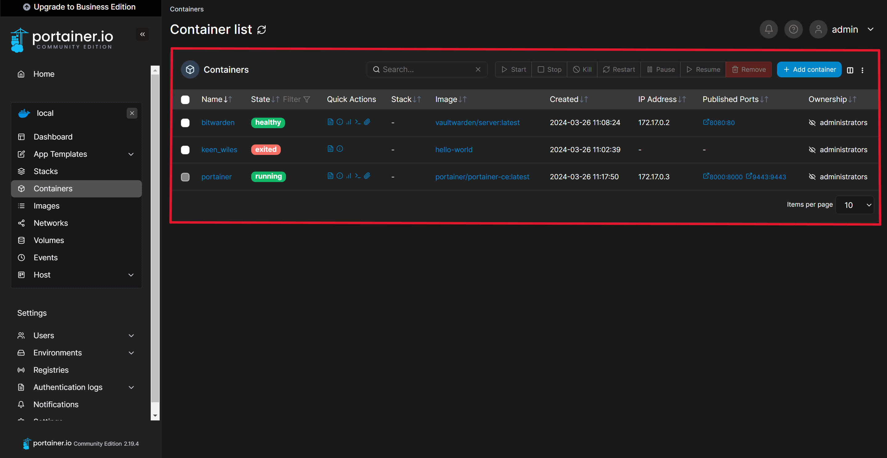
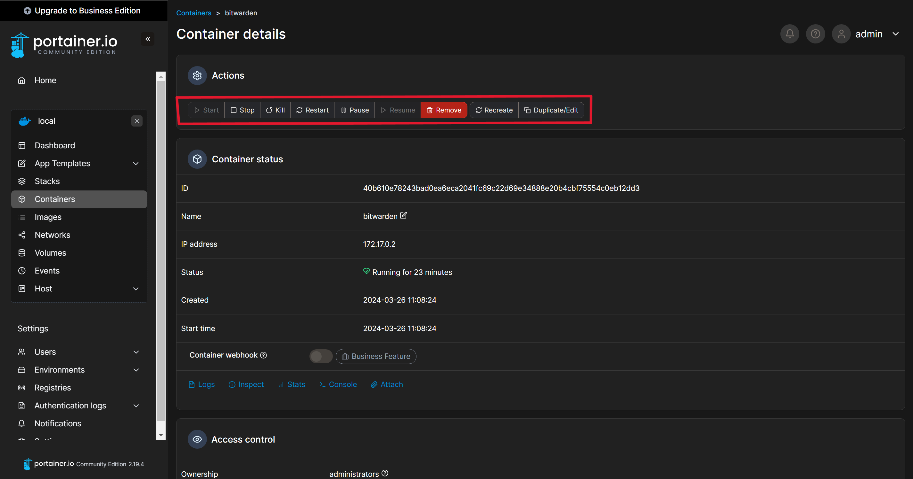
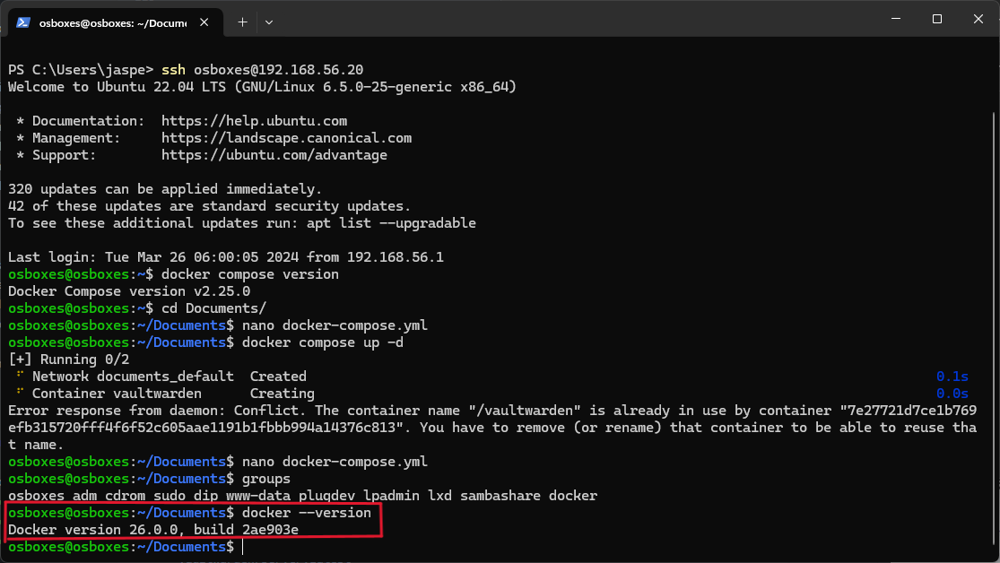
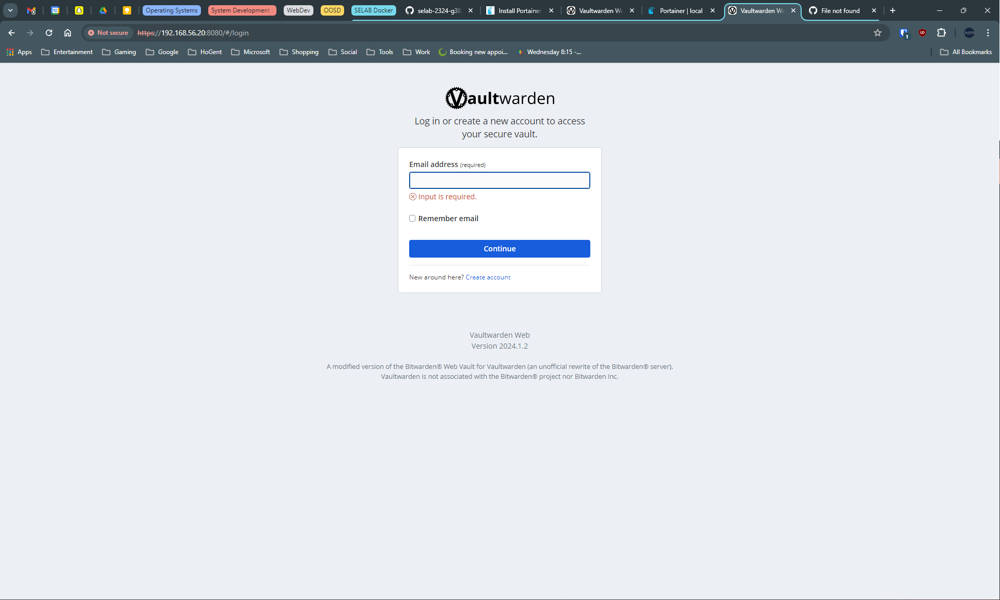
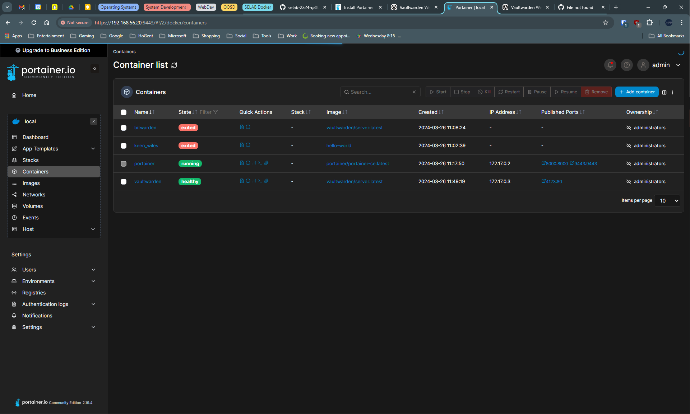

# Verslag 3: Webserver opstellen

> Naam verslaggever: Jasper Meersschaut

## :speech_balloon: Beschrijving
In deze opdracht gaan we aan de slag met Docker en Docker Compose. Docker is een soort van virtualisatie waarbij je applicaties in containers kan draaien. Docker Compose is een tool waarmee je meerdere containers kan beheren. We gaan een Vaultwarden en Portainer container opzetten. Vaultwarden is een open-source wachtwoordmanager en Portainer is een tool waarmee je Docker containers kan beheren.
## :thinking: Antwoorden op de vragen in de opdracht

**Wat is \${USER}?**

`${USER}` is een variabele die de gebruikersnaam van de huidige gebruiker bevat.

**Welk commando kan je gebruiken om jouw gebruikersnaam te bepalen?**

Met het commando: `echo $USER`

**Welke commando's gebruik je voor vaultwarden te installeren?**

```bash
docker pull vaultwarden/server:latest
docker run -d --name vaultwarden -v /vw-data/:/data/ --restart unless-stopped -p 80:80 vaultwarden/server:latest
```

**Wat doet het docker pull commando?**

Het docker pull commando haalt een image van een container op van de Docker Hub.

**Hoe kan je alle lokale images bekijken?**

Met het commando: `docker images`

**Hoe bekijk je alle lokaal draaiende containers?**

Met het commando: `docker ps`

**Hoe bekijk je alle lokale containers (inclusief de gestopte containers)?**

Met het commando: `docker ps -a`

**Waarom heeft Vaultwarden HTTPS nodig?**

Vaultwarden heeft HTTPS nodig omdat het een webapplicatie is die gevoelige informatie bevat. HTTPS zorgt ervoor dat de communicatie tussen de client en de server versleuteld is.

**Welke commando's gebruik je voor portainer te downloaden?**

```bash
docker volume create portainer_data
docker run -d -p 8000:8000 -p 9443:9443 --name portainer --restart=always -v /var/run/docker.sock:/var/run/docker.sock -v portainer_data:/data portainer/portainer-ce:latest
```

> Nu is het mogelijk om Portainer te bereiken via <http://192.168.56.20:8000> of <https://192.168.56.20:9443>.

**Inspecteer jouw containers: kan je de Portainer en Vaultwarden containers zien?**

Ja, ik kan de Portainer en Vaultwarden containers zien.
|  |
| :-----------------------------------------------------: |
| Figuur 1. Portainer en Vaultwarden containers |

**Kan je de Vaultwarden afsluiten en terug opstarten via Portainer?**

Ja, als je op een container klikt in Portainer kan je de container stoppen en herstarten.
|  |
| :-----------------------------------------------------: |
| Figuur 2. Vaultwarden herstarten via Portainer |

**Je kan dit Docker Compose bestand activeren met behulp van `docker compose up -d`. Wat doet de -d optie?**

Dit staat voor detach en zorgt ervoor dat de containers in de achtergrond draaien.

**Hoe kan je het Docker commando voor jouw Portainer applicatie omvormen naar een docker-compose.yml bestand?**

Docker commando:

```bash
docker volume create portainer_data
docker run -d -p 8000:8000 -p 9443:9443 --name portainer --restart=always -v /var/run/docker.sock:/var/run/docker.sock -v portainer_data:/data portainer/portainer-ce:latest
```

Docker Compose bestand:

```yaml
services:
  portainer:
    image: portainer/portainer-ce:latest
    container_name: portainer
    restart: always
    ports:
      - 8000:8000
      - 9443:9443
    volumes:
      - /var/run/docker.sock:/var/run/docker.sock
      - portainer_data:/data
```

**Je maakt een enkel docker-compose.yml bestand met daarin beide containers in. Is dit verstandig? Waarom wel of niet?.**

Dit is niet verstandig omdat je dan twee applicaties in één container hebt. Het is beter om de containers apart te houden zodat ze onafhankelijk van elkaar kunnen draaien.

**Hoe verwijder je eenvoudig alle containers uit jouw docker-compose.yml bestand zonder gebruik te maken van docker stop en docker rm?**

Met het commando: `docker-compose down -v`
-v zorgt ervoor dat de volumes ook verwijderd worden.

**Hoe kan je met één commando alle containers, images, networks en volumes verwijderen die niet meer in gebruik zijn?**

Met het commando: `docker system prune --all --volumes --force`

- --all: verwijdert alle containers, images, networks en volumes
- --volumes: verwijdert ook de volumes
- --force: voert de actie uit zonder bevestiging

## :memo: Evaluatiecriteria

- [ ] De `docker-compose.yml` bestanden zijn te vinden op de GitHub repository van de groep.
- [ ] Je kan alle instructies van Docker en Docker compose uitvoeren zonder `sudo` te gebruiken.
- [ ] Je hebt Docker geïnstalleerd en kan dit aantonen met `docker --version`.
- [ ] Je hebt Docker Compose geïnstalleerd en kan dit aantonen met `docker compose version`.
- [ ] Je kan de command line instructies om een Vaultwarden container op te zetten toelichten.
- [ ] Je kan de command line instructies om een Portainer container op te zetten toelichten.
- [ ] Je kan een Vaultwarden container opzetten via Docker Compose op de command line. Je kan surfen via HTTPS naar en inloggen op deze container op het fysieke systeem (bv. via <https://192.168.56.20>).
- [ ] Je hebt deze ook gekoppeld aan een web browser client op het fysieke systeem.
- [ ] Je kan een Portainer container opzetten via Docker Compose op de command line. Je kan surfen naar en inloggen op deze container op het fysieke systeem (bv. via <http://192.168.56.20>). Portainer en Vaultwarden worden op het Portainer dashboard weergegeven met als status "Running".
- [ ] Je hebt een verslag gemaakt op basis van het template.
- [ ] De cheat sheet werd aangevuld met nuttige commando's die je wenst te onthouden.

## :question: Problemen en oplossingen

## :information_desk_person: Voorbereiding demo

### De `docker-compose.yml` bestanden zijn te vinden op de GitHub repository van de groep.

[docker-compose.yml](https://github.com/HOGENT-SELab/selab-2324-g38/tree/main/verslagen/demo's/5-docker)

### Je kan alle instructies van Docker en Docker compose uitvoeren zonder `sudo` te gebruiken.

Voeg jezelf toe aan de `docker` groep:

```bash
sudo usermod -aG docker ${USER}
```

### Je hebt Docker geïnstalleerd en kan dit aantonen met `docker --version`.

|  |
| :------------------------------------------------------: |
|                 Figuur 3. Docker versie                  |

### Je hebt Docker Compose geïnstalleerd en kan dit aantonen met `docker compose version`.

### Je kan de command line instructies om een Vaultwarden container op te zetten toelichten.

```bash
sudo docker run -d --name bitwarden -e ROCKET_TLS='{certs="/ssl/key.crt",key="/ssl/key.pem"}' -v /home/osboxes/Certificates:/ssl -v ~/.files-vaultwarden:/data/ -p 8080:80 vaultwarden/server:latest
```

### Je kan de command line instructies om een Portainer container op te zetten toelichten.

```bash
docker volume create portainer_data
docker run -d -p 8000:8000 -p 9443:9443 --name portainer --restart=always -v /var/run/docker.sock:/var/run/docker.sock -v portainer_data:/data portainer/portainer-ce:latest
```

### Je kan een Vaultwarden container opzetten via Docker Compose op de command line. Je kan surfen via HTTPS naar en inloggen op deze container op het fysieke systeem (bv. via <https://192.168.56.20>).

In mijn geval is het via <https://192.168.56.20:8080>.
|  |
| :-----------------------------------------------------: |
| Figuur 4. Vaultwarden |

### Je hebt deze ook gekoppeld aan een web browser client op het fysieke systeem.

### Je kan een Portainer container opzetten via Docker Compose op de command line. Je kan surfen naar en inloggen op deze container op het fysieke systeem (bv. via <http://192.168.56.20>). Portainer en Vaultwarden worden op het Portainer dashboard weergegeven met als status "Running".

In mijn geval is het via <http://192.168.56.20:8000>.
|  |
| :-----------------------------------------------------: |
| Figuur 5. Portainer |

## Mogelijke uitbreidingen
- Zorg ervoor dat Vaultwarden en Portainer automatisch opstarten bij het opstarten van de VM.
- Installeer vorige opdrachten m.b.v. Docker. Dit is mogelijk met volgende opdrachten:
  - opdracht 2 (databankserver)
  - opdracht 3 (webserver)
  - opdracht 4 (Azure)
    - :bulb: **Hint:** bouw de afzonderlijke componenten van Azure na in Docker containers en gebruik Docker Compose om deze te verbinden.
- Maak een MineTest server aan: velen van jullie zullen de term "server" voor het eerst gehoord hebben bij multiplayer games. De server is het toestel waarop een match/wereld/... gehost wordt. De server zorgt er ook voor dat gamers samen kunnen spelen door hen te joinen in deze match/wereld/... . Je kan met behulp van Docker een [dedicated Minetest server](https://docs.linuxserver.io/images/docker-minetest/) opzetten. Minetest is een open source Minecraft clone en is volledig gratis te downloaden op <https://www.minetest.net/> .
  - Wat betekent "dedicated" hier?
  - Probeer ook of andere teamleden via een LAN-netwerk kunnen inloggen op de Minetest server zodat jullie samen kunnen spelen. Wat moet je hiervoor aanpassen of instellen?
    - :exclamation: **Let op:** Het schoolnetwerk zal de verbindingen tegenhouden. Als je dit op de campus wil uittesten, maak je best even gebruik van een mobiele hotspot.
## Reflecties

<!-- Wat was moeilijk? Wat was eenvoudig? Wat hebben jullie geleerd van de opdracht? Wat zouden jullie anders doen als jullie het opnieuw moesten doen?

Als jullie nog andere opmerkingen hebben over de opdracht hebben, voel je vrij om ze te delen. -->

## Bronnen

<!-- Maak een lijst van alle bronnen die jullie hebben gebruikt tijdens het uitvoeren van de opdracht: boeken, handleidingen, HOWTO's, blog posts, enz. -->
