# Verslag: Troublesshooting

> Naam verslaggever: Kjell Van Den Bossche

## Beschrijving

Het doel van de opdracht is dat we kunnen omgaan met het optreden van fouten. We moeten logs kunnen lezen en begrijpen, en zo het probleem oplossen.

## Evaluatiecriteria

Toon na afwerken het resultaat aan je begeleider. Elk teamlid moet in staat zijn om het resultaat te demonstreren bij de oplevering van deze opdracht! Criteria voor beoordeling:

- [x] Er is een volledig werkende virtuele machine volgens de eindsituatie.
- [x] Je hebt een verslag gemaakt op basis van het template.
  - [x] Het verslag bevat een duidelijke beschrijving van de problemen die je hebt gevonden mét de oplossingen. **Per type machine is er een aparte beschrijving!**
- [x] De cheat sheet werd aangevuld met nuttige commando's die je wenst te onthouden voor later.

## Problemen en oplossingen

### Machine 1

- Webserver:
  - Apache is nog niet aangezet, doe dit door eerst `sudo systemctl enable apache2` uit te voeren en daarna `sudo systemctl restart apache2` uit te voeren.
- Databankserver:
  - De databank is bereikbaar voor elke machine via TCP en SSH. Om TCP connecties te blokkeren pas je in het `/etc/mysql/mysql.conf.d/mysqld.cnf`-bestand het `bind-address` aan van `0.0.0.0` naar `127.0.0.1`. Daarna restart je de sql-service met `sudo systemctl restart mysql.service`.
- Wordpress:
  - Wordpress kan geen connectie maken met de database omdat `wpuser` nog niet is aangemaakt. Doe dit door volgende commando's uit te voeren:
  ```bash
    mysql -u admin -p
  ```
  ```mysql
  create user 'wpuser'@'%' identified by 'letmein!';
  grant all privileges on *.* to 'wpuser'@'%';
  flush privileges;
  exit;
  ```
- Vaultwarden:
  - Vaultwarden werd opengesteld op poort `80`, dit moet poort `4123` zijn.
  - In de environment wordt bij de `ROCKET_TLS` een variabele `folder_vaultwarden` gebruikt bij het pad, deze variabele bestaat niet en om het pad te vervolledigen vervang je dit door `/opt`.
- Portainer:
  - Het volume staat in omgekeerde volgorde ingesteld (namelijk `/data:portainer_data`), dit moet aangepast worden naar `portainer_data:/data`.
- Planka:
  - In de environment staat er een variabele leeg ingesteld (namelijk `- # SECRET_KEY=...`), dit moet aangepast worden naar `- SECRET_KEY=...`

```
sudo dpkg-reconfigure keyboard-configuration
sudo reboot
sudo nano /etc/netplan/01-network-manager-all.yaml
addresses: - 192.168.56.56/24 > - 192.168.56.20/24
sudo netplan apply

============================== Webserver ==================================
sudo systemctl enable apache2
sudo systemctl restart apache2
===========================================================================

============================== Databankserver ==============================
sudo nano /etc/mysql/mysql.conf.d/mysqld.cnf
bind-address = 0.0.0.0 > bind-address = 127.0.0.1
sudo systemctl restart mysql.service
===========================================================================

============================== Wordpress ==================================
mysql -u admin -p
create user 'wpuser'@'%' identified by 'letmein!';
grant all privileges on *.* to 'wpuser'@'%';
flush privileges;
exit;
===========================================================================

docker compose -f docker/docker-compose.yml down
sudo nano docker/docker-compose.yml

============================== Vaultwarden ================================
ports: - 80:80 > - 4123:80
environment: - ROCKET_TLS={certs="${folder_vaultwarden}/keys/vaultwarden.crt",key="${folder_vaultwarden}/keys/vaultwarden.key"} > - ROCKET_TLS={certs="/opt/keys/vaultwarden.crt",key="/opt/keys/vaultwarden.key"}
===========================================================================

============================== Portainer ==================================
volumes: - /data:portainer_data > - portainer_data:/data
===========================================================================

docker compose -f docker/docker-compose.yml up -d
sudo nano docker/planka/docker-compose.yml

============================== Planka =====================================
environment: - # SECRET_KEY=... > - SECRET_KEY=...
===========================================================================

docker compose -f docker/planka/docker-compose.yml restart
```

### Machine 2

#### Databankserver (mariadb)

#### 1. De firewall liet geen verkeer toe op poort 3306.

| 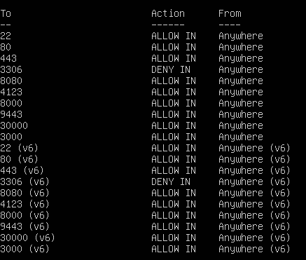 |
| :-------------------------------------------------------------------------: |
|                          Poort 3306 staat op DENY                           |

#### Oplossing:

Verkeer toelaten op poort 3306.

```bash
sudo ufw allow 3306
```

#### 2. Het bind adres stond ingesteld op `0.0.0.0`.

#### Oplossing:

Configuratiebestand mysql openen met nano.

```bash
sudo nano /etc/mysql/mysql.conf.d/mysqld.cnf
```

Bind adres aanpassen.
`bind-address = 0.0.0.0` &rarr; `bind-address = 127.0.0.1`

MySQL herstarten om de veranderingen door te voeren.

```bash
sudo systemctl restart mysql.service
```

#### Wordpress

#### Er stonden enkele fouten in het configuratiebestand.

| 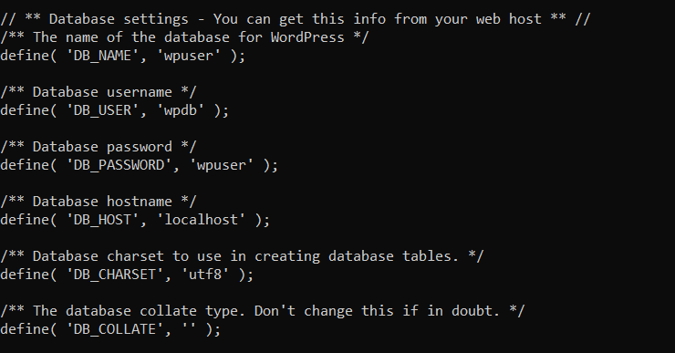 |
| :----------------------------------------------------------------------------------------: |
|                                Configuratiefouten wordpress                                |

#### Oplossing:

Configuratiebestand openen en aanpassen met nano volgens screenshot.

```bash
sudo nano /var/www/wordpress/wp-config.php
```

| 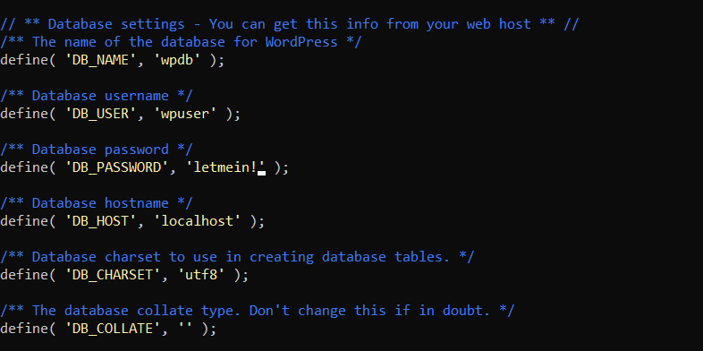 |
| :--------------------------------------------------------------------------------: |
|                       Configuratiefouten wordpress opgelost                        |

Apache herstarten om de veranderingen door te voeren:

```bash
sudo systemctl restart apache2
```

#### SSH

#### Remote host identification changed:

| 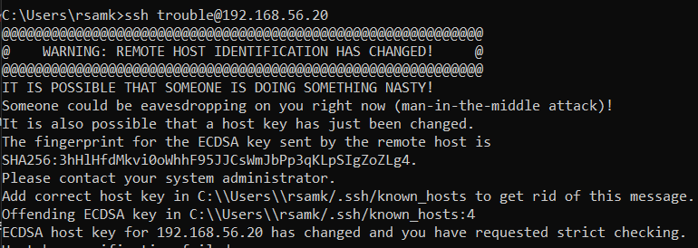 |
| :--------------------------------------------------------------------------------------------------------: |
|                                  Remote host identification has changed.                                   |

#### Oplossing:

Regel verwijderen in `C:\Users\%username%\.ssh\known_hosts` (Windows) met het IP-adres van de VM.

```
============================== Toetsenbord ================================
sudo dpkg-reconfigure keyboard-configuration
sudo reboot
============================== Pingen =====================================
sudo nano /etc/netplan/01-network-manager-all.yaml
addresses: - 192.168.56.56/24 > - 192.168.56.20/24
sudo netplan apply
============================== Apache =====================================
demo.html added (FileZilla)
```

### Machine 3

1. Netwerk
   -Kon niet pingen naar 192.168.56.20 vanuit eigen machine.
   Oplossing: netwerk configuratie file aanpassen:
   | 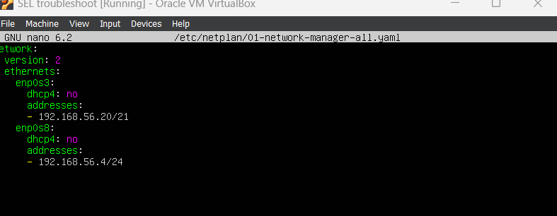 |
   | :----------------------------------------------------------------------: |
   | Aanpassing config file. |

### Machine 4

1. Verbinden met FileZilla
   -> ssh stond niet actief, was niet running.

`systemctl status ssh `
`sudo systemctl enable ssh `
`sudo systemctl restart ssh `

-> hierna succesvolle connectie met Filezilla

2. Error establishing connection to database bij Wordpress
   -> zoek folder `sudo find / -name wp-config.php`-> zet name user, passwd en host goed
   -> wijzigingen doorvoeren met` sudo systemctl restart apache2`dan had ik nog steeds een error, nog steeds dezelfde.
   Gecheckt of de database wel echt bereikbaar was vanop de server waarop wordpress wordt gehost.
   -> met`mysql -u wpuser -p -h 192.168.56.20 wpdb`hier kreeg ik een error.
   dan in mysql workbench via de admin de priveleges aangepast
   met:`GRANT SELECT, INSERT, UPDATE, DELETE, CREATE, DROP, ALTER, INDEX, CREATE TEMPORARY TABLES, LOCK TABLES ON wpdb.\* TO 'wpuser'@'192.168.56.20';`
   `FLUSH PRIVELEGES `

3. Minetest niet beschikbaar
   -> fout in de docker compose op line 19

4. Planka niet bereikbaar
   -> docker compose fout ingesteld

5. Poort 3306 stond op deny
   -> `sudo ufw allow 3306 `

ip adres ingesteld in plaats van localhost.

### Machine 5

#### Probleem 1: De firewall staat niet goed ingesteld

#### Oplossing 1: Poort 22 openen in de firewall

- De poort 22 stond niet open in de firewall, waardoor het niet mogelijk was om een SSH verbinding te maken.

```bash
sudo ufw allow 22
```

| 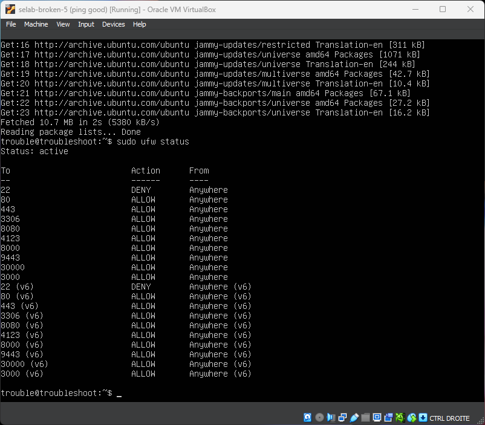 |
| :----------------------------------------------------------------------: |
|                          Poort 22 staat op deny                          |

#### Probleem 2: Er kan geen SSH verbinding gemaakt worden

#### Oplossing 2.1: De poort van SSH juist instellen in de configuratie

```bash
sudo nano /etc/ssh/sshd_config
```

- De poort stond ingesteld op 22222 in plaats van 22.

| 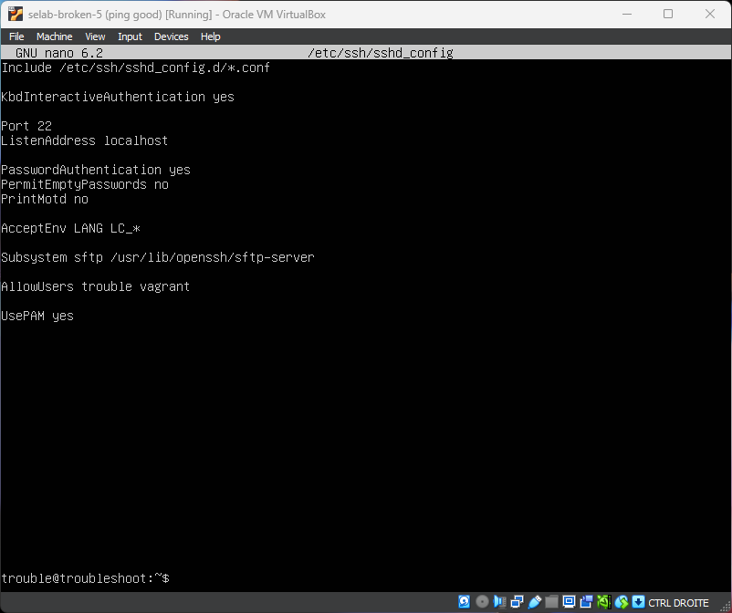 |
| :-------------------------------------------------------------------: |
|                       SSH poort ingesteld op 22                       |

#### Oplossing 2.2: Het listen adres van ssh stond niet goed ingesteld

- Het listen adres stond ingesteld op localhost, waardoor het niet mogelijk was om van buitenaf te verbinden.

```bash
sudo nano /etc/ssh/sshd_config
```

| 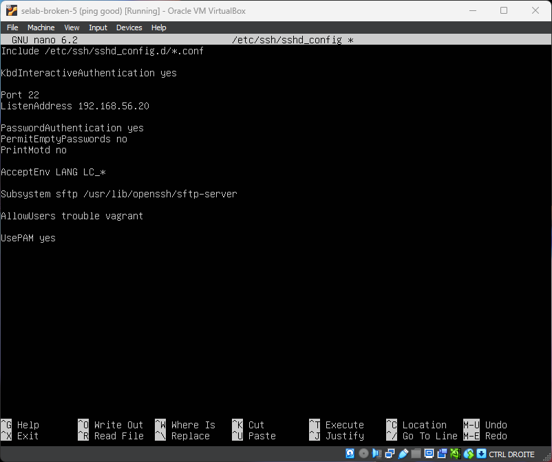 |
| :---------------------------------------------------------------------: |
|               ListenAddress aangepast naar 192.168.56.20                |

#### Probleem 3: Remote host identification has changed

| 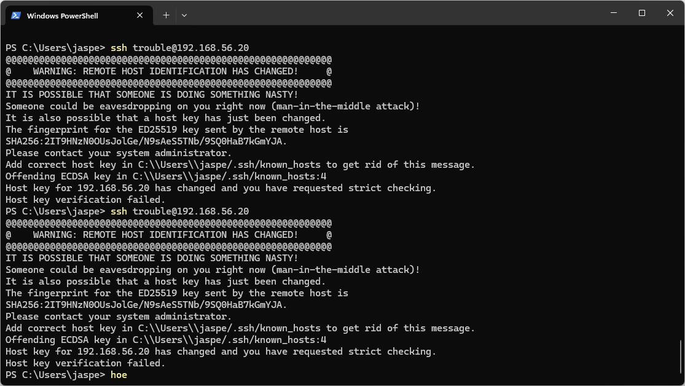 |
| :---------------------------------------------------: |
|        Remote host identification has changed         |

#### Oplossing 3.1: De known_hosts file aanpassen

- In windows kan je de known_hosts file vinden in `C:\Users\%username%\.ssh\known_hosts`
- Verwijder de regel met het ip adres van de VM

> Dit was waarsschijnlijk geen probleem van de opdracht maar van mezelf door het andere key was van de vm maar hetzelfde ip adres. Maar ik heb het er toch bijgezet.

#### Probleem 4: Databank: De admin user kan bereikbaar zijn vanaf elke host

- Doe `SELECT Host, User FROM mysql.user WHERE User = 'admin';`
- Door `%` is de host overal bereikbaar
  | 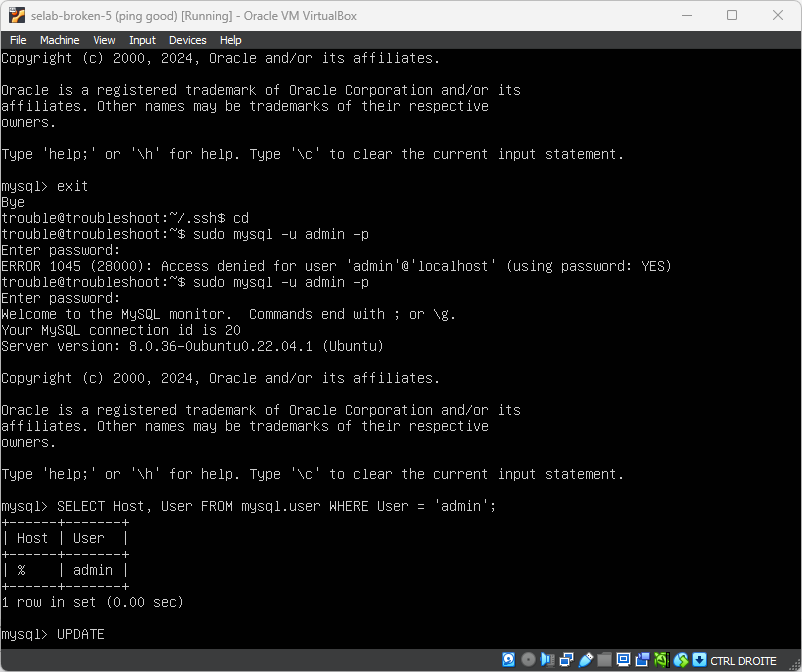 |
  | :-------------------------------------------------: |
  | MySQL databank is bereikbaar vanaf elke host |

#### Oplossing 4.1: De admin user enkel bereikbaar maken vanaf localhost

```sql
UPDATE mysql.user SET Host = 'localhost' WHERE User = 'admin';
FLUSH PRIVILEGES;
```

| 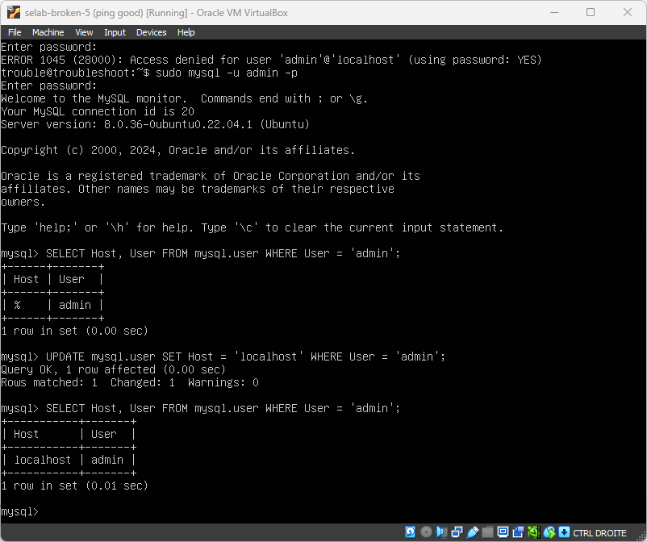 |
| :---------------------------------------------------------: |
|     MySQL databank is enkel bereikbaar vanaf localhost      |

#### Probleem 5: Wordpress: De database is niet bereikbaar

```mysql
SHOW DATABASES;
```

- De Database bestond niet
  | 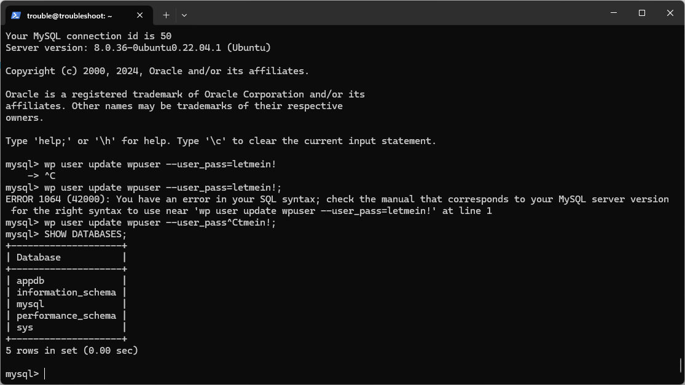 |
  | :-------------------------------------------------: |
  | MySQL databank bestaat niet |

#### Oplossing 5.1: De database aanmaken

```mysql
CREATE DATABASE wpdb;
```

| 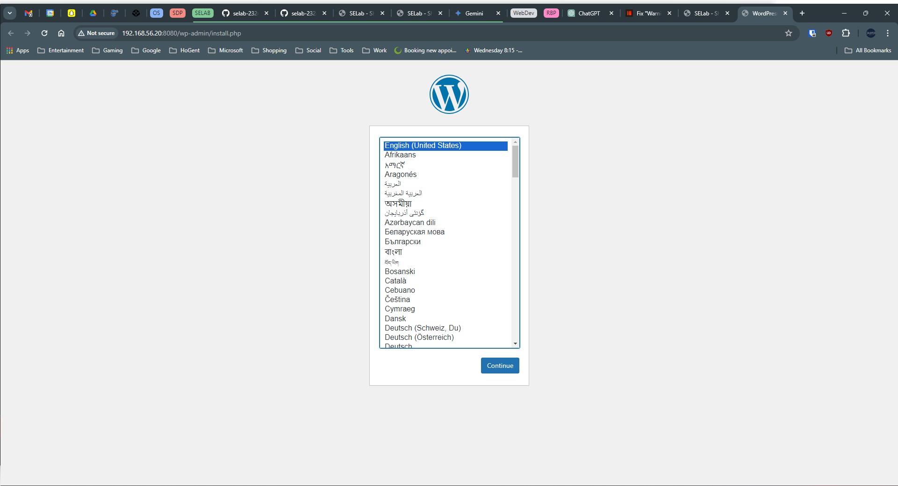 |
| :-----------------------------------------------------------: |
|          MySQL databank is bereikbaar voor Wordpress          |

#### Probleem 6: Planka werkt niet

#### Oplossing 6.1: De key uit commentaar halen en de admin name en password aanpassen

```bash
sudo nano docker/planka/docker-compose.yml
```

| 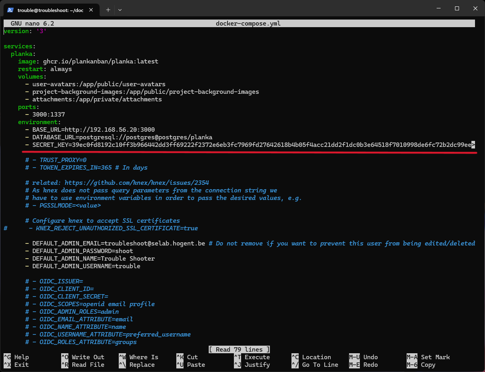 |
| :-----------------------------------------------: |
|                  Planka werkt nu                  |

## Reflecties

Het troubleshooten verliep vrij vlot. Ik heb toegepast wat we voorgaande opdrachten hebben geleerd om zo de machine te doen werken.
